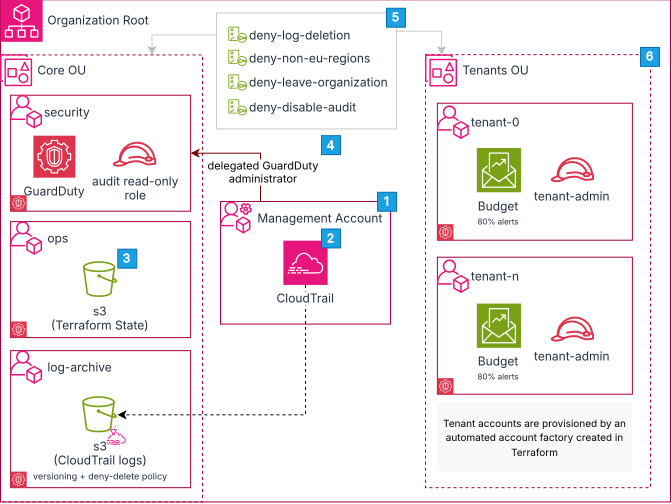
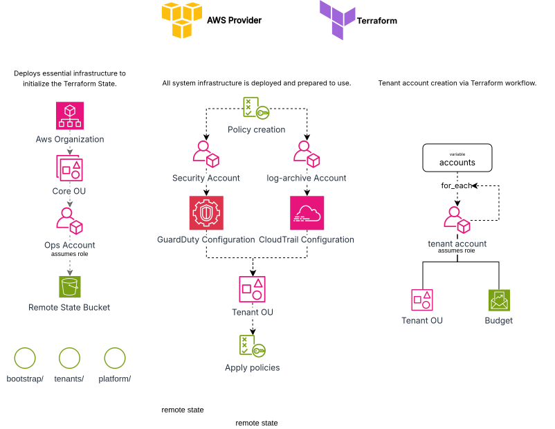

# terraform-aws-silo-landing-zone
Terraform reference architecture: multi-account AWS landing zone with a tenant account factory for regulated fintech platforms.

## Problem

## Architecture
Financial platforms serving multiple business clients face a hard requirement: data and worlkloads must be verifibly separated, with an audit trail no one can tamper and control over where data physically resides.

Whereas shared infrastructure with logical separation is cheaper, a single bug or misconfiguration can leak data across clients.

This architecture uses the AWS account as the boundary itself and automates provisioning so creating Tenant accounts is no longer a manual work, but an automated and governed process.

### AWS account architecture
The organization is split in two OUs: The Core OU which holds platform accounts, and the Tenant OU where each client account is provisioned. Guardrails are applied at OU level, so they apply independently of what happens inside of each account.

1. Terraform uses the Management Account only to deploy and configure the platform, which limits the usage of high privilege actions.
2. Organization-wide CloudTrail captures API activity across every account. Logs are delivered to a bucket in the isolated log-archive account, where versioning and a deny-delete policy make the audit trail tamper-evident, an account compromise cannot erase its own tracks.
3. Terraform state lives in a dedicated operations account, separate from the management account that governs the organization. This limits blast radius and lets state access be granted independently of organization-level permissions, an operator who deploys tenants does not need rights over the organization root. NEED CHANGE
4. GuardDuty is enabled across all accounts, with findings aggregated in the security account as delegated administrator. Centralising detection outside the accounts being monitored means a compromised tenant cannot suppress its own alerts.
5. Each client receives a dedicated AWS account rather than shared infrastructure. The account boundary is the strongest isolation primitive AWS offers — one client's workload cannot reach another's, and billing, access and audit trails are separated by construction. Pooled multi-tenancy is cheaper to operate, but cannot provide the per-client separation regulated financial workloads require.

### Terraform provisioning flow
Infrastructure is divided in three different Terraform configurations: Bootstrap initializes the organization and creates the s3 bucket which is going to be used by the other configurations, Platform creates the core accounts and setups each control and policy, and then Factory automates tenant account creation.

1. PENDING ANNOTATIONS 

## Design decisions and trade-offs
### One AWS account per tenant
Each client is provided with a separated account instead of a logically separated piece of shared infrastructure.

**Why?** A bug, a misconfiguration or missing filter can cross client boundaries. AWS accounts boundaries means that each client is separated by the platform itself, and will not be able to address other's if there is not an explicit and auditable trust relationship.

**Trade-off.** Significantly higher operational cost.

### Custom Terraform instead of AWS Control Tower

The landing zone is built from Terraform resources rather than provisioned through AWS Control Tower.

**Why?** Building it using Control Tower is a pragmatic option for most companies. However, providing the infrastructure via Terraform keeps every account, policy and role in version control, where changes are diffable and the reasoning is visible.

Trade-off. More work and ongoing maintenance in exchange for full control over the implementation.

### Three Terraform configurations with separate state

Infrastructure is splitted in three Terraform configurations: Bootstrap, Platform and Factory. Each of it with its own state.

**Why?** The separation is due to different execution rates. Bootstrap runs once to create the organization and initialize the remote state bucket, and the Factory runs every ttime a new client is onboarded.

**Trade-off.** Three configurations to develop, maintain, plus cross-layer references through terraform_remote_state that must be kept stable.

### close_on_deletion = false on tenant accounts

Tenant account resources are explicitly configured not to close the underlying AWS account when destroyed.

**Why?** With close_on_deletion = true, removing one line from the tenant map would begin closing a client's account. Account closure is not reversible after ninety days, so a routine configuration edit could become permanent data loss for a client. 

**Trade-off.** Offboarding is a two-step process: remove the tenant from configuration, then close the account manually. The account remains in the organization until that second step is taken, so decommissioning requires follow-through rather than being implicit in the apply.

## Tenant onboarding and offboarding (PENDING)

Automatically created by Factory workload.

offboarding is a two step process...

## Scope and future work

This is a reference architecture, scoped to the account structure, governance controls and provisioning mechanism. Deliberately out of scope:

Event-driven provisioning. Accounts are vended by an operator running Terraform, not by a signup workflow. See Path to automation.
Identity federation. The tenant-admin role's trust policy is parameterised; in production this would be backed by IAM Identity Center or an external IdP.
Security Hub and AWS Config. GuardDuty covers threat detection; broader posture management and configuration compliance are the next layer.
Tenant workload networking. Accounts are delivered as a governed empty foundation; what runs inside is the client's concern.

## Path to automation (PENDING)
VCS, Pipeline, Event-driven

## Deployment (PENDING)
Prerequisites: AWS account, Terraform >= 1., credentials with organization-level permissions

1. bootstrap  — organization, Core OU, state backend
2. platform   — core accounts, org-wide CloudTrail, GuardDuty, SCPs
3. tenants    — account factory

Each layer reads the previous one through remote state.